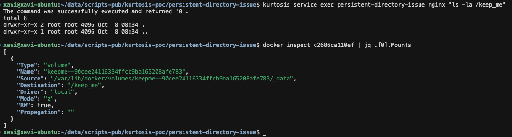
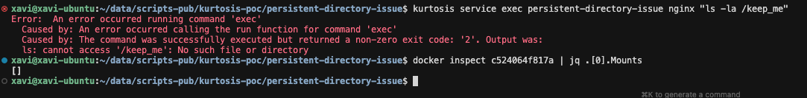

# Persistent Directory issue PoC

## Deploy enclave, it should run OK.

```
kurtosis run --enclave persistent-directory-issue .
```

You can check the folder is there inside the service and also through docker command:




## Update image from 1.28 to 1.29

```
kurtosis service update --image nginx:1.29 persistent-directory-issue nginx
```

The update runs ok, but then the folder is not there.


